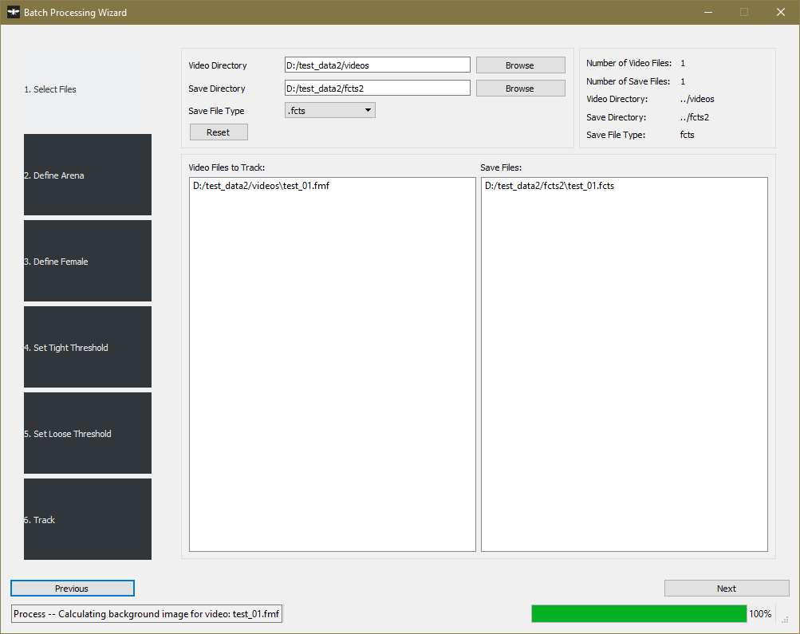
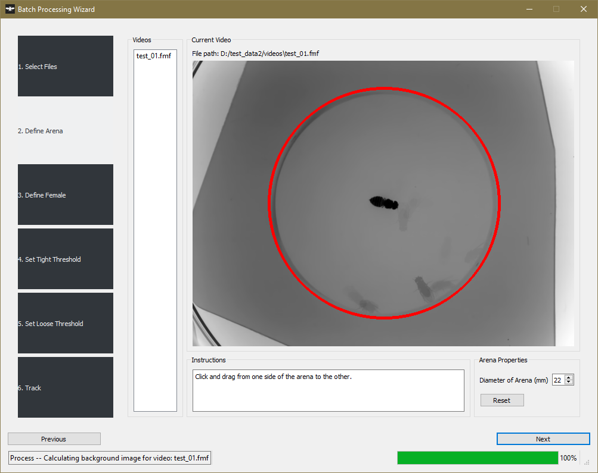
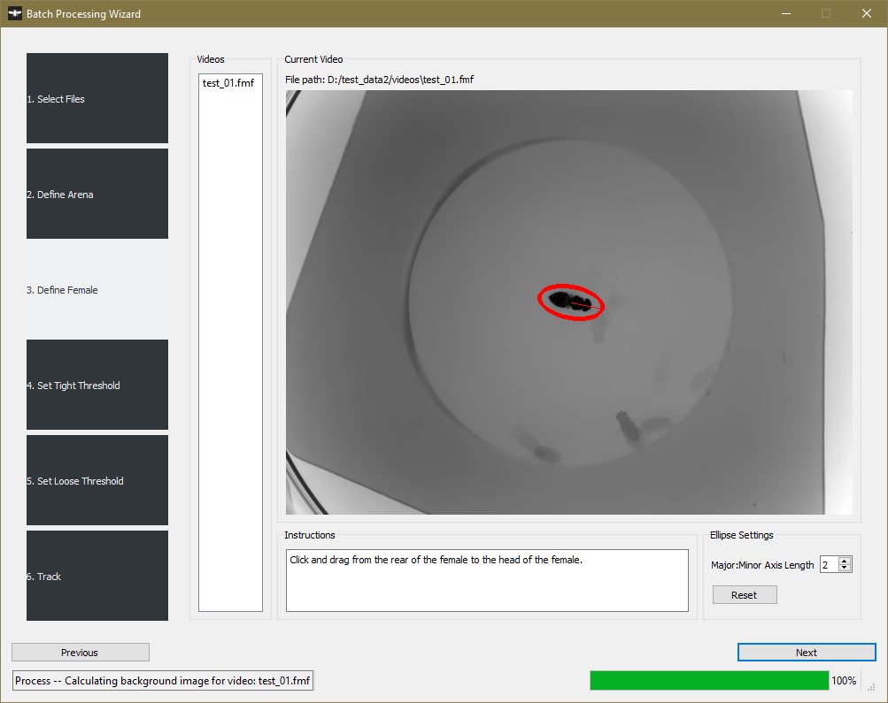

# Tutorial

## Using the GUI

To use the GUI, make sure that the 'courtship' environment is activated, and then type the following in a terminal:

~~~bash
courtship-app
~~~

This will launch the GUI, and take you to the main user interface (Fig 1).

**Figure 1. Main user interface.**

The main interface will only show a video, video navigation buttons/slider, and a File Explorer tree view initially. Tracking statistics and behavioral classifications will open if a FixedCourtshipTrackingSummary (.fcts) file and its associated video are opened.

Use the 'File' menu to open a video, or open a file directory in the 'File Explorer' tree view by pressing `Ctrl+O`. If a video has already been tracked, you can open that video and tracking summary (.fcts) also throught the 'File' menu.

The main utility of this GUI is to track a set of videos. To track videos, go to 'Tracking->Batch Processing'. This will open the Batch Processing Dialog window (Fig 2).

**Figure 2. Batch Processing Dialog window.** *(Step 1) Select a directory containing video files (.fmf) to track, select a directory to save tracked files, and select a save file type.*

### Step 1
Within the batch processing dialog, you will be led through 6 steps. In the first step (Figure 2), you will be asked to select a directory containing the videos that you would like to track. I'd recommend creating a `videos` folder that only contains the videos you're tracking. You will also be asked to select a save directory and save file type; I'd also recommend creating a folder specifically for holding tracking files.

The tracking software allows you to save files as either `.fcts` or `.xlxs`. `.fcts` files are nothing more than pickled python objects, so if you plan on doing your analyses outside of python, save tracked files as `.xlsx`; otherwise, save as `.fcts`. You can always convert `.fcts` files to `.xlsx` later.

### Step 2

**Figure 4. Define arenas.**

In the next step, you will be asked to define an arena for each of the videos you're tracking.

As you click through each video, a background image will be calculated for that video (which is what the progress bar at the bottom of the GUI is showing).

Click and drag from one side of the arena to the other. Make sure the arena is defined so that it is as close to the actual arena as possible; any regions outside of the arena will be excluded from tracking. You can click and drag as many times as you'd like; if you aren't happy with the arena you've defined, just try again.

You won't be able to proceed to the next step until an arena has been defined for every video to-be-tracked.

Note: only circular arenas are allowed at this time.

### Step 3

## Analyzing Data
